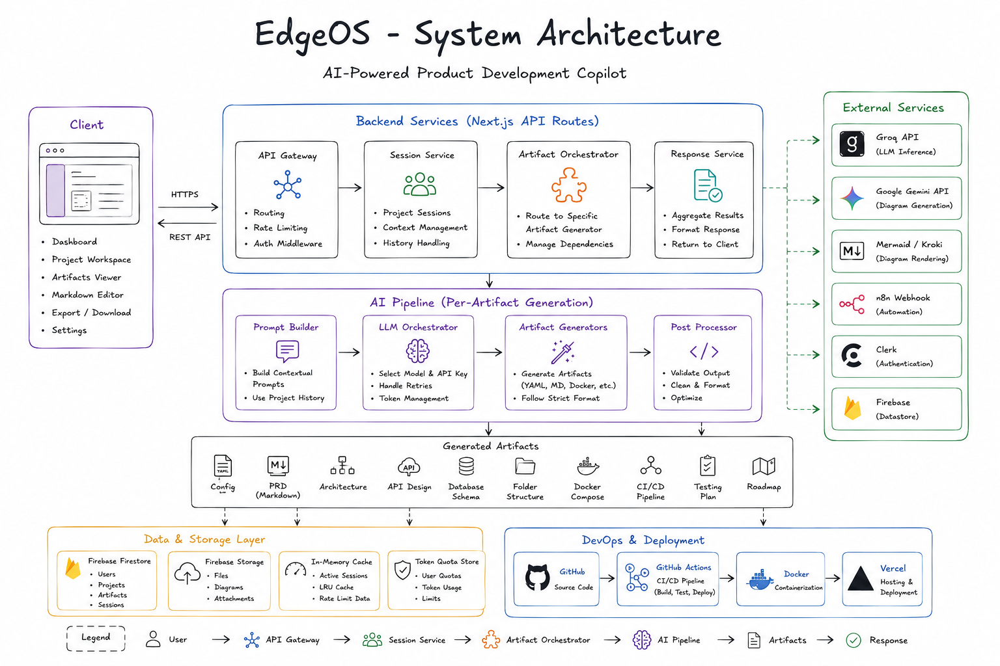

<div align="center">

# 🚀 EdgeOS

### From an Idea to a Complete Software Blueprint.

AI-powered product development planning that transforms a simple product idea into developer-ready documentation, architecture, APIs, database schemas, roadmaps, and technical plans.

---

[]()
[]()
[]()
[]()
[]()
[]()
[]()

---

**🏆 Hackathon Submission**

Build software smarter—not harder.

</div>

---

# 📖 Table of Contents

- 🚀 Introduction
- ❓ Problem Statement
- 📉 Why Existing Workflow is Broken
- 💡 Our Solution
- ⚙️ How It Works
- 🔄 Demo Flow
- ✨ Features
- 🏗️ System Architecture
- 🤖 AI Pipeline
- 🛠️ Tech Stack
- 📸 Screenshots
- 📈 Future Roadmap
- ❤️ Why We Built This
- 🌍 Market Opportunity
- 🚀 Impact
- ⚡ Installation
- 🔐 Environment Variables
- ▶️ Run Locally
- 👥 Team

---

# 🚀 Introduction

EdgeOS is an AI-powered Product Development Planning Platform.

Instead of spending days creating technical documentation before writing code, developers simply describe their product idea.

EdgeOS then generates the planning artifacts required throughout the Software Development Lifecycle (SDLC).

From Product Requirement Documents to Database Schemas and Deployment Guides, EdgeOS helps teams move from **idea → planning → development** much faster.

---

# ❓ Problem Statement

Building software is much more than writing code.

Before development even starts, teams need to create:

- Product Requirement Documents (PRDs)
- User Stories
- Roadmaps
- Architecture Diagrams
- API Specifications
- Database Schemas
- Folder Structures
- Docker Configurations
- CI/CD Pipelines
- Testing Plans
- Deployment Documentation

These tasks are usually completed manually using multiple tools.

This consumes valuable engineering time before a single feature is built.

---

# 📉 Why Existing Workflow is Broken

Today, software teams constantly switch between different tools.

| Tool | Purpose |
|-------|----------|
| Notion | Documentation |
| Jira | Sprint Planning |
| Excalidraw | Architecture |
| dbdiagram | Database Design |
| Swagger | API Documentation |
| Docker Docs | Deployment |
| GitHub | Version Control |

This fragmented workflow causes:

- ❌ Context Switching
- ❌ Duplicate Documentation
- ❌ Slow Planning
- ❌ Inconsistent Architecture
- ❌ Delayed Development
- ❌ Higher Technical Debt

For startups and hackathon teams, this overhead is significant.

---

# 💡 Our Solution

EdgeOS centralizes software planning into one AI-powered workspace.

Instead of manually creating every planning artifact, developers simply describe their project idea.

EdgeOS generates the technical foundation required before development begins.

Instead of this:

Idea

↓

Notion

↓

Jira

↓

Excalidraw

↓

Swagger

↓

dbdiagram

↓

Docker

↓

Development

EdgeOS enables:

Idea

↓

EdgeOS AI

↓

Complete Software Blueprint

↓

Development

---

# ⚙️ How It Works

### 1️⃣ Describe Your Product

Write your software idea in natural language.

Example:

> Build an AI-powered bookmark manager with semantic search.

---

### 2️⃣ AI Understands Your Project

EdgeOS analyzes:

- Product goals
- Features
- Tech stack
- Functional requirements
- System architecture

---

### 3️⃣ Generate the Software Blueprint

The platform creates a comprehensive planning document containing:

- Product Documentation
- API Design
- Database Schema
- Folder Structure
- Testing Strategy
- Roadmap & Deployment Planning

---

### 4️⃣ Start Building

Review, edit and export the entire project blueprint as Markdown before development begins.

---

# 🔄 Demo Flow

```text
💡 Product Idea
        │
        ▼
🤖 AI Analysis
        │
        ▼
📄 Product Requirements
        │
        ▼
🗺️ Roadmap
        │
        ▼
🗄️ Database Schema
        │
        ▼
🔗 API Design
        │
        ▼
🏗️ Architecture
        │
        ▼
🐳 Docker & CI/CD
        │
        ▼
🧪 Testing Plan
        │
        ▼
📘 Final Documentation
        │
        ▼
🚀 Start Development
```

---

# ✨ Key Features

✅ AI Product Planning

✅ Product Requirement Documents

✅ User Story Generation

✅ Roadmap Generation

✅ API Design

✅ Database Schema Generation

✅ Software Architecture Planning

✅ Folder Structure Generation

✅ Testing & Deployment Strategy

✅ Complete Software Blueprint Generation

✅ Export as Markdown

✅ Secure Authentication

✅ Persistent Projects

---
# 🏗️ System Architecture

The platform follows a modular architecture where every AI artifact is generated independently and can be regenerated without affecting other outputs.


<p align="center">



</p>

### Architecture Overview

```
                    User
                      │
                      ▼
           🌐 Next.js Frontend
                      │
                      ▼
        Authentication (Clerk)
                      │
                      ▼
         AI Generation Engine
                      │
     ┌────────┬────────┬────────┐
     ▼        ▼        ▼        ▼
 Product   Database   API    Config
 Docs      Schema     Design Planning
     │        │        │        │
     └────────┴────────┴────────┘
                 │
                 ▼
        Markdown Documentation
                 │
                 ▼
         Firebase Project Storage
```

---

## 🧩 Architecture Components

| Component | Responsibility |
|-----------|----------------|
| 🌐 Frontend | User Interface & Project Management |
| 🔐 Clerk | Authentication & User Management |
| 🤖 AI Engine | Generates the software blueprint |
| 🔥 Firebase | Stores generated projects |
| 📄 Markdown Renderer | Displays generated documentation |
| 🧠 Groq / Gemini | Large Language Models |
| 📦 Export Engine | Markdown Export |

---

# 🤖 AI Pipeline

Unlike traditional AI applications that return a single response, EdgeOS generates multiple technical artifacts independently.

Each artifact can also be regenerated without affecting the others.

```text
Project Idea
      │
      ▼
Prompt Understanding
      │
      ▼
Project Analysis
      │
      ├──────────────┐
      │              │
      ▼              ▼
Product Docs     Config
      │              │
      ▼              ▼
Database       API Design
      │              │
      ▼              ▼
Folder Structure
      │
      ▼
Testing & Deployment
      │
      ▼
Final Markdown Blueprint
```

---

## ⚡ AI Generation Pipeline

Each module works independently to construct the final blueprint.

| Component | Purpose |
|-----------|----------|
| 📄 Product Documentation | Project overview and requirements |
| ⚙️ Config | Project configuration |
| 🗄️ Database Schema | Database design |
| 🔗 API Design | REST API endpoints |
| 📂 Folder Structure | Recommended project structure |
| 🧪 Testing & Deployment | QA and deployment strategy |
| 📘 Final Markdown | Combined comprehensive blueprint |

---

# 🛠️ Tech Stack

## Frontend

- Next.js 16.2.0 (App Router)
- React 19.2.4
- TypeScript
- Tailwind CSS 4.0
- Shadcn UI
- Framer Motion

---

## Backend & Workflows

- Next.js API Routes
- Mermaid.js

---

## Authentication

- Clerk

---

## Database

- Firebase Firestore & Firebase Admin SDK

---

## AI

- Groq API
- Google Gemini API


---

## Documentation

- Markdown
- Mermaid
- YAML

---

## Deployment

- Vercel

---

# 📦 Project Structure

```text
EdgeOS/
│
├── app/
│   ├── api/
│   ├── dashboard/
│   └── auth/
│
├── components/
│   ├── ui/
│   ├── dashboard/
│   └── landing/
│
├── lib/
│
├── hooks/
│
├── constants/
│
├── public/
│
├── styles/
│
├── docs/
│   ├── system-architecture.png
│   └── screenshots/
│
├── types/
│
└── README.md
```

---

# 📸 Screenshots & Demo

## 📸 Landing Page Screenshot

> **[Pending]**

---

## 📸 Dashboard Screenshot

> **[Pending]**

---

## 🎥 Demo GIF (20–30 seconds)

> **[Pending]**

---

## 📄 Generated Documentation

> _Add screenshot here_

```text
docs/screenshots/documentation.png
```

---

## 🏗️ Generated Architecture

> _Add screenshot here_

```text
docs/screenshots/architecture.png
```

---

## 🔄 AI Workflow

```text
User Idea
    │
    ▼
AI Processing
    │
    ├── Documentation
    ├── APIs
    ├── Database
    ├── Docker
    ├── Testing
    ├── Roadmap
    └── Deployment
    │
    ▼
Review & Edit
    │
    ▼
Export Markdown
    │
    ▼
Development
```

---

## 🎯 Design Principles

EdgeOS follows five core principles:

- ✅ AI assists developers rather than replacing them.
- ✅ Every artifact is independently editable.
- ✅ Modular architecture for easy scalability.
- ✅ Production-oriented documentation.
- ✅ Faster planning, better software development.

---

# 📈 Future Roadmap

We envision EdgeOS evolving into a more collaborative platform that supports teams throughout their planning phases.

---

## 🚀 Phase 1 — Planning (Current)

- ✅ AI Product Documentation
- ✅ Project Configuration
- ✅ API Design
- ✅ Database Schema
- ✅ Folder Structure
- ✅ Testing & Deployment Strategy
- ✅ Markdown Export

---

## 🚀 Phase 2 — Future Enhancements

- Team Workspaces
- Shared Documentation
- Project Templates
- Version History

---

# ❤️ Why We Built This

Software development has evolved dramatically.

Planning hasn't.

Developers spend countless hours creating documentation before writing the first line of code.

Most planning tasks are repetitive and require switching between multiple tools.

We wanted to simplify that process.

Instead of replacing developers, EdgeOS helps them focus on building by generating the technical foundation every project needs.

---

# 🌍 Market Opportunity

Every software team follows a planning phase before development.

This includes:

- Product Requirement Documents
- User Stories
- Roadmaps
- API Specifications
- Database Design
- Architecture Planning
- Testing Documentation

These tasks consume a significant portion of project time.

EdgeOS aims to centralize and accelerate this workflow through AI-powered planning.

Potential users include:

- 🚀 Startup Founders
- 💻 Software Engineers
- 📱 Indie Hackers
- 🏢 Development Agencies
- 🎯 Product Managers
- 🎓 Students
- 🏆 Hackathon Teams

---

# 🚀 Impact

Instead of spending days preparing technical documentation,

developers can begin building within minutes.

EdgeOS reduces planning overhead and provides a structured foundation for software projects.

Our goal is simple:

> Spend less time planning.

> Spend more time building.

---

# ⚡ Installation

Clone the repository

```bash
git clone https://github.com/your-username/edgeos.git
```

Move into the project

```bash
cd edgeos
```

Install dependencies

```bash
npm install
```

---

# 🔐 Environment Variables

Create a `.env.local` file.

```env
NEXT_PUBLIC_CLERK_PUBLISHABLE_KEY=

CLERK_SECRET_KEY=

GROQ_API_KEY=

GOOGLE_GEMINI_API_KEY=

FIREBASE_PROJECT_ID=

FIREBASE_CLIENT_EMAIL=

FIREBASE_PRIVATE_KEY=
```

---

# ▶️ Run Locally

Start the development server

```bash
npm run dev
```

Visit

```text
http://localhost:3000
```

---

# 📂 Generated Output

EdgeOS generates a **single comprehensive Markdown Software Blueprint** containing all technical planning details, including:

- 📄 Product Documentation
- ⚙️ Project Configuration
- 🗄️ Database Schema
- 🔗 API Design
- 📂 Folder Structure
- 🧪 Testing & Deployment Strategy

---

# 🤝 Contributing

Contributions are always welcome.

If you would like to improve EdgeOS:

1. Fork the repository

2. Create a feature branch

```bash
git checkout -b feature/my-feature
```

3. Commit your changes

```bash
git commit -m "Add new feature"
```

4. Push your branch

```bash
git push origin feature/my-feature
```

5. Open a Pull Request

---

# 👥 Team

Built with ❤️ during a Hackathon.

Developer

**Krish Gupta**

---

# 📜 License

This project is licensed under the MIT License.

---

# 🙌 Acknowledgements

Special thanks to the amazing open-source ecosystem.

- Next.js
- React
- Tailwind CSS
- Clerk
- Firebase
- Groq
- Google Gemini
- Vercel

---

# ⭐ Support

If you found this project interesting,

please consider giving it a ⭐ on GitHub.

It motivates us to continue improving EdgeOS.

---

<div align="center">

# 🚀 EdgeOS

### One Idea.

### One Workspace.

### Complete Software Blueprint.

---

Made with ❤️ for developers, founders, and builders.

</div>